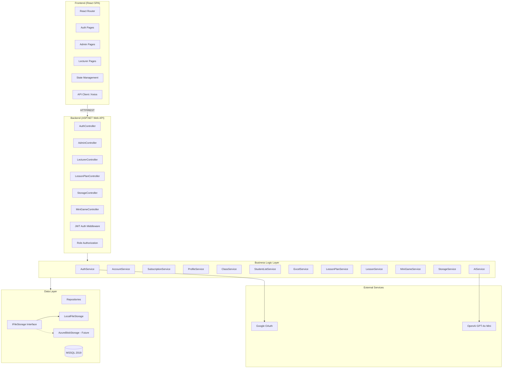

# Design Document: Teaching Management Platform

## Overview

This document describes the technical design for a web-based teaching management platform targeting Vietnamese teachers and lecturers. The platform enables lecturers to manage classes, students, lesson plans, teaching materials, and AI-generated mini games. Admins manage lecturer accounts and subscription packages.

The system follows a three-tier architecture: React SPA frontend, ASP.NET Web API backend, and MSSQL 2019 database. Authentication supports both database credentials and Google OAuth. AI features leverage OpenAI GPT-4o Mini for quiz generation. File storage uses a link-with-metadata pattern for future Azure Blob Storage migration.

### Key Design Decisions

1. **Link-based file storage**: Files are stored locally during development with metadata (name, date, size) in the database. The storage layer is abstracted behind an interface to support future Azure Blob Storage migration without API changes.
2. **Role-based routing**: After authentication, users are routed to role-specific dashboards (Lecturer vs Admin) with separate page sets.
3. **Excel import/export via header matching**: Student list import scans the first row of the Excel file and matches column headers to the student list's column names.
4. **AI quiz generation**: OpenAI GPT-4o Mini reads document links and attachment content from a lesson to generate quiz-type mini games.
5. **Vietnamese-only UI**: All labels, messages, dates (dd/MM/yyyy), and currency formats are in Vietnamese. No i18n framework needed since only one locale is supported.

## Architecture



### Architecture Layers

- **Frontend**: React SPA with React Router for navigation. Axios for API calls. Role-based route guards redirect unauthorized users.
- **Backend**: ASP.NET Web API with JWT authentication middleware. Controllers are thin, delegating to service layer. Role-based authorization via `[Authorize(Roles = "Admin")]` and `[Authorize(Roles = "Lecturer")]` attributes.
- **Service Layer**: Contains all business logic. Each domain area has a dedicated service. Services interact with repositories and external APIs.
- **Data Layer**: Repository pattern over Entity Framework Core with MSSQL 2019. File storage abstracted behind `IFileStorage` interface.

## Components and Interfaces

### Frontend Components

```
src/
├── pages/
│   ├── auth/
│   │   ├── LoginPage.tsx
│   │   └── RegisterPage.tsx
│   ├── admin/
│   │   ├── AccountManagementPage.tsx
│   │   └── SubscriptionPackagePage.tsx
│   └── lecturer/
│       ├── OverviewPage.tsx
│       ├── ClassListPage.tsx
│       ├── ClassDetailPage.tsx
│       ├── LessonPlanPage.tsx
│       └── TeachingMaterialStoragePage.tsx
├── components/
│   ├── common/          # Shared UI components (Table, Modal, Button, etc.)
│   ├── admin/           # Admin-specific components
│   ├── lecturer/        # Lecturer-specific components
│   │   ├── ProfileEditModal.tsx
│   │   ├── StudentListTabs.tsx
│   │   ├── StudentListTable.tsx
│   │   ├── ExcelImportModal.tsx
│   │   ├── LessonPlanModal.tsx
│   │   ├── LessonDetailModal.tsx
│   │   ├── MiniGameCreateModal.tsx
│   │   └── StorageFileList.tsx
│   └── layout/          # Navigation, Sidebar, Header
├── services/            # API client functions
├── hooks/               # Custom React hooks
├── types/               # TypeScript interfaces
└── utils/               # Helpers (date formatting, currency formatting)
```


### Backend API Interfaces

#### AuthController
| Method | Endpoint | Description |
|--------|----------|-------------|
| POST | `/api/auth/login` | Login with database credentials |
| POST | `/api/auth/google` | Login with Google OAuth token |
| POST | `/api/auth/register` | Register new database account |

#### AdminController
| Method | Endpoint | Description |
|--------|----------|-------------|
| GET | `/api/admin/accounts` | List all lecturer accounts |
| POST | `/api/admin/accounts` | Create lecturer account |
| PUT | `/api/admin/accounts/{id}` | Update lecturer account |
| DELETE | `/api/admin/accounts/{id}` | Delete lecturer account |
| PATCH | `/api/admin/accounts/{id}/status` | Activate/deactivate account |
| GET | `/api/admin/subscriptions` | List subscription packages |
| POST | `/api/admin/subscriptions` | Create subscription package |
| PUT | `/api/admin/subscriptions/{id}` | Update subscription package |
| DELETE | `/api/admin/subscriptions/{id}` | Delete subscription package |

#### LecturerController
| Method | Endpoint | Description |
|--------|----------|-------------|
| GET | `/api/lecturer/profile` | Get lecturer profile |
| PUT | `/api/lecturer/profile` | Update lecturer profile |

#### ClassController
| Method | Endpoint | Description |
|--------|----------|-------------|
| GET | `/api/classes` | List lecturer's classes |
| POST | `/api/classes` | Create class |
| PUT | `/api/classes/{id}` | Update class |
| DELETE | `/api/classes/{id}` | Delete class |
| GET | `/api/classes/{id}` | Get class detail (basic info, student count) |

#### StudentListController
| Method | Endpoint | Description |
|--------|----------|-------------|
| GET | `/api/classes/{classId}/student-lists` | List student lists for a class |
| POST | `/api/classes/{classId}/student-lists` | Create student list |
| PUT | `/api/student-lists/{id}` | Update student list |
| DELETE | `/api/student-lists/{id}` | Delete student list |
| PATCH | `/api/student-lists/{id}/set-main` | Set as main student list |
| POST | `/api/student-lists/{id}/clone` | Clone student list |
| POST | `/api/student-lists/{id}/columns` | Add column |
| POST | `/api/student-lists/{id}/students` | Add student entry |
| PUT | `/api/student-lists/{id}/students/{studentId}` | Update student entry |
| DELETE | `/api/student-lists/{id}/students/{studentId}` | Delete student entry |
| POST | `/api/student-lists/{id}/import-excel` | Import from Excel |
| GET | `/api/student-lists/{id}/export-excel` | Export to Excel |

#### LessonPlanController
| Method | Endpoint | Description |
|--------|----------|-------------|
| GET | `/api/lesson-plans` | List lesson plans (with search/filter) |
| POST | `/api/lesson-plans` | Create lesson plan |
| PUT | `/api/lesson-plans/{id}` | Update lesson plan |
| DELETE | `/api/lesson-plans/{id}` | Delete lesson plan |
| GET | `/api/lesson-plans/{id}` | Get lesson plan with lessons |

#### LessonController
| Method | Endpoint | Description |
|--------|----------|-------------|
| GET | `/api/lessons/{id}` | Get lesson detail (documents, attachments, mini games) |
| PUT | `/api/lessons/{id}` | Update lesson detail |
| POST | `/api/lessons/{id}/documents` | Add document |
| DELETE | `/api/lessons/{id}/documents/{docId}` | Delete document |
| POST | `/api/lessons/{id}/attachments` | Add attachment |
| DELETE | `/api/lessons/{id}/attachments/{attId}` | Delete attachment |

#### ClassLessonPlanController
| Method | Endpoint | Description |
|--------|----------|-------------|
| PUT | `/api/classes/{classId}/lesson-plan` | Assign lesson plan to class |
| GET | `/api/classes/{classId}/lesson-plan` | Get assigned lesson plan with schedule |
| PUT | `/api/classes/{classId}/lessons/{lessonId}/schedule` | Update lesson schedule date |

#### MiniGameController
| Method | Endpoint | Description |
|--------|----------|-------------|
| POST | `/api/lessons/{lessonId}/mini-games` | Create mini game (triggers AI generation) |
| GET | `/api/mini-games/{id}` | Get mini game detail |
| DELETE | `/api/mini-games/{id}` | Delete mini game |
| GET | `/api/mini-games/{id}/play` | Get mini game play data |

#### StorageController
| Method | Endpoint | Description |
|--------|----------|-------------|
| GET | `/api/storage` | List storage items (with search/filter/sort) |
| GET | `/api/storage/{folderId}` | List folder contents |
| POST | `/api/storage/folders` | Create folder |
| POST | `/api/storage/files` | Upload file |
| PUT | `/api/storage/{id}/rename` | Rename item |
| DELETE | `/api/storage/{id}` | Delete item |

### Key Service Interfaces

```csharp
// File storage abstraction for future Azure migration
public interface IFileStorage
{
    Task<string> SaveFileAsync(Stream fileStream, string fileName);
    Task<Stream> GetFileAsync(string fileReference);
    Task DeleteFileAsync(string fileReference);
    Task<FileMetadata> GetMetadataAsync(string fileReference);
}

// AI service for mini game generation
public interface IAIService
{
    Task<QuizContent> GenerateQuizAsync(List<DocumentInfo> documents, List<AttachmentInfo> attachments);
}

// Excel service for import/export
public interface IExcelService
{
    Task<ExcelValidationResult> ValidateHeaders(Stream excelStream, List<string> expectedColumns);
    Task<List<Dictionary<string, string>>> ImportData(Stream excelStream, List<string> columns);
    Task<byte[]> ExportData(List<string> columns, List<Dictionary<string, string>> rows);
}
```


## Data Models

### Entity Relationship Diagram

```mermaid
erDiagram
    User {
        int Id PK
        string Email
        string PasswordHash
        string FullName
        string Role "Admin | Lecturer"
        string GoogleId "nullable"
        string Status "Active | Inactive"
        datetime CreatedAt
        datetime UpdatedAt
    }

    LecturerProfile {
        int Id PK
        int UserId FK
        string FullName
        string Introduction
    }

    ProfileOccupation {
        int Id PK
        int ProfileId FK
        string Value
        int SortOrder
    }

    ProfileTeachingLocation {
        int Id PK
        int ProfileId FK
        string Value
        int SortOrder
    }

    ProfileExpertise {
        int Id PK
        int ProfileId FK
        string Specialty
        string Degree
        string CertificateImageUrl
        int SortOrder
    }

    ProfileExperience {
        int Id PK
        int ProfileId FK
        string Description
        string ImageUrl
        int SortOrder
    }

    ProfileTeachingSkill {
        int Id PK
        int ProfileId FK
        string Description
        string ImageUrl
        int SortOrder
    }

    ProfileTuitionFee {
        int Id PK
        int ProfileId FK
        string Description
        int SortOrder
    }

    ProfileNote {
        int Id PK
        int ProfileId FK
        string Content
        int SortOrder
    }

    SubscriptionPackage {
        int Id PK
        string Name
        decimal Price
        long StorageLimitBytes
        string UnlockedFeatures "JSON array"
        datetime CreatedAt
        datetime UpdatedAt
    }

    Class {
        int Id PK
        int LecturerId FK
        string Name
        string Year
        int AssignedLessonPlanId FK "nullable"
        datetime CreatedAt
        datetime UpdatedAt
    }

    StudentList {
        int Id PK
        int ClassId FK
        string Name
        bool IsMain
        datetime CreatedAt
    }

    StudentListColumn {
        int Id PK
        int StudentListId FK
        string Name
        int SortOrder
    }

    StudentEntry {
        int Id PK
        int StudentListId FK
        string Data "JSON object keyed by column name"
        int SortOrder
    }

    LessonPlan {
        int Id PK
        int LecturerId FK
        string Subject
        string Grade
        string SchoolYearStart
        string SchoolYearEnd
        datetime CreatedAt
        datetime UpdatedAt
    }

    Lesson {
        int Id PK
        int LessonPlanId FK
        string Name
        int OrderIndex
        datetime ScheduledDate "nullable"
    }

    LessonDocument {
        int Id PK
        int LessonId FK
        string Name
        string Link
        string PageRange
    }

    LessonAttachment {
        int Id PK
        int LessonId FK
        string FileName
        string FileReference
        long FileSize
    }

    MiniGame {
        int Id PK
        int LessonId FK
        string Name
        string Description
        string Type "Quiz"
        string Content "JSON - generated quiz data"
        datetime CreatedAt
    }

    StorageItem {
        int Id PK
        int LecturerId FK
        int ParentFolderId FK "nullable"
        string Name
        string ItemType "File | Folder"
        string FileReference "nullable"
        string FileType "nullable - word, excel, pptx, text, pdf"
        long FileSize "nullable"
        datetime ModifiedAt
        datetime CreatedAt
    }

    User ||--o| LecturerProfile : has
    LecturerProfile ||--o{ ProfileOccupation : has
    LecturerProfile ||--o{ ProfileTeachingLocation : has
    LecturerProfile ||--o{ ProfileExpertise : has
    LecturerProfile ||--o{ ProfileExperience : has
    LecturerProfile ||--o{ ProfileTeachingSkill : has
    LecturerProfile ||--o{ ProfileTuitionFee : has
    LecturerProfile ||--o{ ProfileNote : has
    User ||--o{ Class : owns
    Class ||--o{ StudentList : contains
    StudentList ||--o{ StudentListColumn : has
    StudentList ||--o{ StudentEntry : has
    User ||--o{ LessonPlan : owns
    LessonPlan ||--o{ Lesson : contains
    Lesson ||--o{ LessonDocument : has
    Lesson ||--o{ LessonAttachment : has
    Lesson ||--o{ MiniGame : has
    User ||--o{ StorageItem : owns
    StorageItem ||--o{ StorageItem : "parent folder"
    Class ||--o| LessonPlan : "assigned plan"
```

### Key Data Model Notes

1. **StudentEntry.Data**: Stored as a JSON object where keys are column names and values are the cell data. This allows dynamic columns without schema changes.
2. **MiniGame.Content**: Stored as JSON containing the generated quiz questions, options, and answers.
3. **StorageItem**: Self-referential via `ParentFolderId` to support nested folder structure. `FileReference` is the path/key used by `IFileStorage` to locate the actual file.
4. **SubscriptionPackage.UnlockedFeatures**: JSON array of feature identifiers (e.g., `["ai_mini_games", "excel_export", "storage_50gb"]`).
5. **User.PasswordHash**: Passwords are hashed using bcrypt. Google OAuth users may have a null password hash.
6. **Lesson.ScheduledDate**: Only populated when a lesson plan is assigned to a class and the lecturer sets dates.


## Correctness Properties

*A property is a characteristic or behavior that should hold true across all valid executions of a system — essentially, a formal statement about what the system should do. Properties serve as the bridge between human-readable specifications and machine-verifiable correctness guarantees.*

### Property 1: Authentication returns correct role token

*For any* valid user credentials (database or Google OAuth), authenticating should return a JWT token containing the correct user role (Lecturer or Admin), and the indicated redirect target should match that role (Lecturer → Lecturer dashboard, Admin → Admin dashboard).

**Validates: Requirements 1.1, 1.2, 1.6**

### Property 2: Invalid credentials produce generic error

*For any* invalid credential combination (wrong email, wrong password, or both), the authentication error message should be identical regardless of which field is incorrect, never revealing whether the email exists.

**Validates: Requirements 1.3**

### Property 3: Registration hashes passwords

*For any* registration request with a plaintext password, the stored password hash should differ from the plaintext input, and verifying the hash against the original password should succeed.

**Validates: Requirements 1.5**

### Property 4: Account CRUD round-trip

*For any* valid lecturer account data, creating the account and then listing all accounts should include the created account with matching data. Updating any field and then retrieving should reflect the change. Deleting should remove it from the list.

**Validates: Requirements 2.1, 2.2, 2.3, 2.4**

### Property 5: Account status toggle affects login ability

*For any* active lecturer account, deactivating it should set status to inactive and authentication with that account's credentials should fail. Reactivating should set status to active and authentication should succeed again.

**Validates: Requirements 2.5, 2.6**

### Property 6: Subscription package CRUD round-trip

*For any* valid subscription package data (name, price, storage limit, unlocked features), creating the package and then retrieving it should return identical data. Updating fields should be reflected on retrieval. Deleting should remove it from the list.

**Validates: Requirements 3.1, 3.2, 3.3, 3.4**

### Property 7: Subscription package validation

*For any* subscription package with a negative price or non-positive storage limit, the system should reject the creation/update and return a validation error. *For any* package with non-negative price and positive storage limit, the operation should succeed.

**Validates: Requirements 3.5**

### Property 8: Profile save/retrieve round-trip with multi-entry fields

*For any* lecturer profile data including multiple occupations, teaching locations, expertise rows, experience entries (with images), teaching skills (with images), tuition fees, and notes, saving the profile and then retrieving it should return all entries with matching data and correct ordering.

**Validates: Requirements 4.1, 4.3, 4.4, 4.5, 4.6**

### Property 9: Class CRUD round-trip

*For any* valid class data (name, year), creating the class and then listing the lecturer's classes should include it. Updating should reflect changes. Deleting should remove the class and all associated student lists and lesson assignments.

**Validates: Requirements 5.1, 5.2, 5.3, 5.4**

### Property 10: Student count derived from main student list

*For any* class with a designated main student list, the student count returned in the class basic information should equal the number of student entries in that main student list.

**Validates: Requirements 6.1, 6.2**

### Property 11: Main student list uniqueness invariant

*For any* class with multiple student lists, after marking any list as the main list, exactly one list should have `IsMain = true` and all others should have `IsMain = false`.

**Validates: Requirements 7.3**

### Property 12: Student list operations round-trip

*For any* class, creating a student list should add it to the class. Adding columns should increase the column count. Adding student entries should persist the data. Cloning a list should produce a copy with identical columns and data. Editing an entry should reflect changes. Deleting an entry should remove it.

**Validates: Requirements 7.1, 7.2, 7.4, 7.5, 7.6, 7.7**

### Property 13: Excel import/export round-trip

*For any* student list with columns and data, exporting to Excel and then importing that Excel file into a new student list with the same columns should produce identical data. The exported file's first row should match the column names. When headers don't match, the system should identify exactly which headers are mismatched.

**Validates: Requirements 8.1, 8.2, 8.3, 9.1, 9.2**

### Property 14: Lesson plan CRUD round-trip

*For any* valid lesson plan data (subject, grade, school year, list of lessons), creating the plan and then retrieving it should return matching data. Adding lessons should increase the lesson count. Editing should reflect changes. Deleting should remove the plan.

**Validates: Requirements 10.1, 10.4, 10.5, 10.6, 10.7**

### Property 15: Lesson plan search and filter

*For any* search/filter query on lesson plans (by grade, subject, or school year), all returned lesson plans should match the filter criteria, and no matching plans should be excluded.

**Validates: Requirements 10.2**

### Property 16: Lesson detail CRUD round-trip

*For any* lesson, adding a document (with name, link, page range) should persist all fields. Adding an attachment should persist the file reference. Updating the lesson detail should reflect all changes. Deleting a document or attachment should remove it from the lesson.

**Validates: Requirements 11.2, 11.3, 11.4, 11.5**

### Property 17: Mini game lifecycle

*For any* lesson with documents and attachments, creating a mini game should invoke the AI service with the lesson's document links and attachment data. Upon successful generation, the mini game should appear in the lesson's mini game list with correct name, type, and content. Viewing should return the full content. Deleting should remove it from the lesson.

**Validates: Requirements 12.2, 12.3, 12.6, 12.7**

### Property 18: Class lesson plan scheduling

*For any* class with an assigned lesson plan, the system should return all lessons with schedule date fields. Updating a lesson's date should persist. Searching within the lesson list should return only lessons whose names match the query. The plan display should include each lesson's documents, attachments, and mini games.

**Validates: Requirements 13.2, 13.3, 13.5, 13.6**

### Property 19: Storage CRUD round-trip

*For any* storage operations, creating a folder should add it to the list. Uploading a file should store metadata (name, date, size) and the file reference. Opening a folder should show exactly its contents. Renaming should update the name. Deleting should remove the item.

**Validates: Requirements 14.1, 14.2, 14.3, 14.4, 14.5, 14.6**

### Property 20: Storage filter correctness

*For any* search query, all returned storage items should have names containing the query string. *For any* file type filter, all returned items should match the selected type. *For any* date range filter, all returned items should have modification dates within the specified range.

**Validates: Requirements 15.1, 15.2, 15.3**

### Property 21: Storage ordering

*For any* sort option (by name or date, ascending or descending), the returned storage list should be correctly ordered. When folder position is set to "above", all folders should appear before all files. When set to "mixed", folders and files should be interleaved according to the sort order.

**Validates: Requirements 15.4, 15.5**

### Property 22: File storage metadata and content persistence

*For any* uploaded file, the database should contain a record with the file's link reference and metadata (name, modification date, file size), and the actual file content should be retrievable from the local storage path referenced by the link.

**Validates: Requirements 16.1, 16.2**

### Property 23: Vietnamese date formatting

*For any* valid date, the formatted output should match the pattern `dd/MM/yyyy` (e.g., 18/03/2026).

**Validates: Requirements 17.2**

### Property 24: Vietnamese currency formatting

*For any* non-negative numeric amount, the formatted output should use dots as thousand separators and the "đ" suffix (e.g., 100.000đ).

**Validates: Requirements 17.3**


## Error Handling

### Authentication Errors
- Invalid credentials: Return HTTP 401 with generic message "Tên đăng nhập hoặc mật khẩu không đúng" (never reveal which field is wrong)
- Google OAuth failure: Return HTTP 401 with message indicating Google authentication failed, offer retry
- Deactivated account login attempt: Return HTTP 403 with message "Tài khoản đã bị vô hiệu hóa"
- Expired JWT: Return HTTP 401, frontend redirects to login page

### Validation Errors
- Invalid subscription package (negative price, non-positive storage): Return HTTP 400 with field-specific validation messages
- Empty required fields: Return HTTP 400 with field names that are missing
- Invalid Excel headers on import: Return HTTP 400 with list of mismatched column names

### AI Service Errors
- OpenAI API failure (timeout, rate limit, server error): Return HTTP 502 with message "Không thể tạo mini game. Vui lòng thử lại sau."
- Insufficient lesson content for quiz generation: Return HTTP 400 with message indicating more documents are needed

### File Storage Errors
- File upload failure: Return HTTP 500 with generic storage error message
- File not found on retrieval: Return HTTP 404
- Storage quota exceeded (future): Return HTTP 413

### General Error Strategy
- All API errors return a consistent JSON structure: `{ "error": { "code": string, "message": string, "details": object? } }`
- All user-facing error messages are in Vietnamese
- Backend logs detailed error information (stack traces, request context) while returning sanitized messages to the client
- Frontend displays error messages in toast notifications or inline error states

## Testing Strategy

### Unit Testing
- Framework: xUnit (backend), Jest + React Testing Library (frontend)
- Focus areas:
  - Specific examples for each CRUD operation
  - Edge cases: empty inputs, boundary values, special characters in Vietnamese text
  - Error conditions: invalid credentials, failed API calls, malformed Excel files
  - Integration points: controller → service → repository flow
  - Date and currency formatting with specific Vietnamese examples

### Property-Based Testing
- Framework: FsCheck (for .NET/C# backend), fast-check (for TypeScript/React frontend)
- Configuration: Minimum 100 iterations per property test
- Each property test must reference its design document property with a tag comment:
  - Format: `// Feature: teaching-management-platform, Property {number}: {property_text}`

### Property Test Mapping

| Property | Test Location | Library |
|----------|--------------|---------|
| P1-P3: Auth properties | Backend unit tests | FsCheck |
| P4-P5: Account management | Backend unit tests | FsCheck |
| P6-P7: Subscription management | Backend unit tests | FsCheck |
| P8: Profile round-trip | Backend unit tests | FsCheck |
| P9: Class CRUD | Backend unit tests | FsCheck |
| P10: Student count | Backend unit tests | FsCheck |
| P11: Main list uniqueness | Backend unit tests | FsCheck |
| P12: Student list operations | Backend unit tests | FsCheck |
| P13: Excel round-trip | Backend unit tests | FsCheck |
| P14-P15: Lesson plan CRUD/filter | Backend unit tests | FsCheck |
| P16: Lesson detail CRUD | Backend unit tests | FsCheck |
| P17: Mini game lifecycle | Backend unit tests (with mocked AI) | FsCheck |
| P18: Class scheduling | Backend unit tests | FsCheck |
| P19: Storage CRUD | Backend unit tests | FsCheck |
| P20-P21: Storage filter/sort | Backend unit tests | FsCheck |
| P22: File persistence | Backend integration tests | FsCheck |
| P23: Date formatting | Frontend unit tests | fast-check |
| P24: Currency formatting | Frontend unit tests | fast-check |

### Test Organization
- Backend tests: `Tests/` project alongside the main API project
- Frontend tests: Co-located `__tests__/` folders next to components
- Property tests tagged with design document property references
- Unit tests cover specific examples and edge cases
- Property tests cover universal correctness guarantees across randomized inputs
